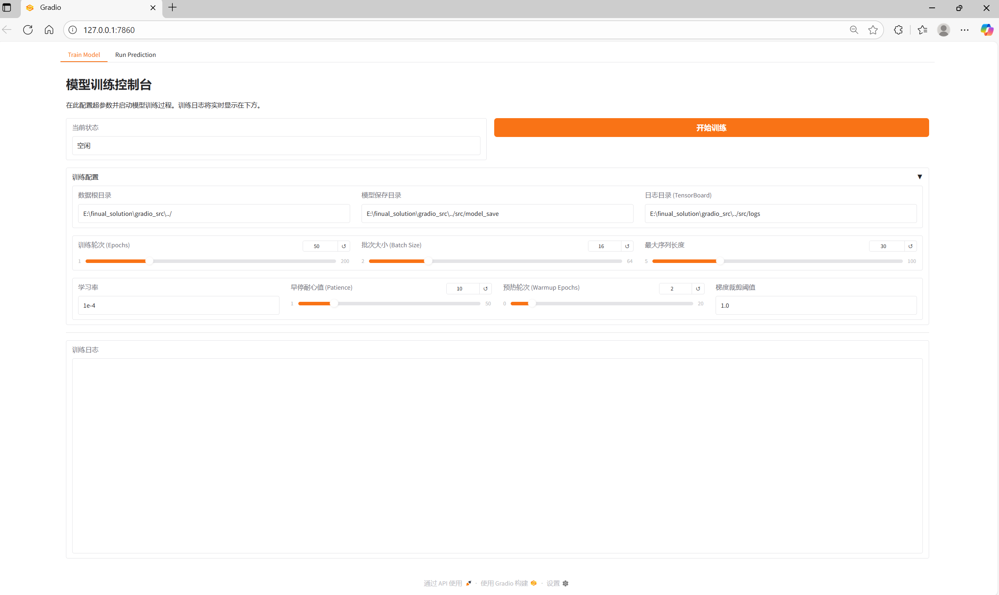
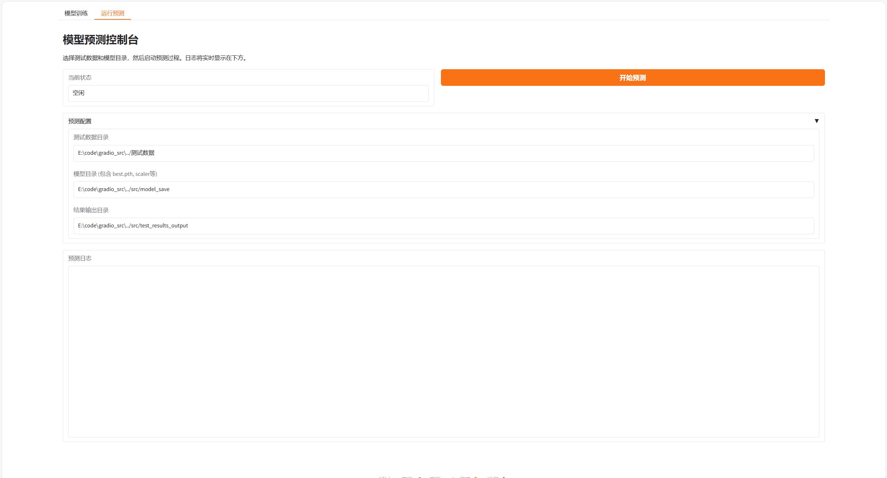
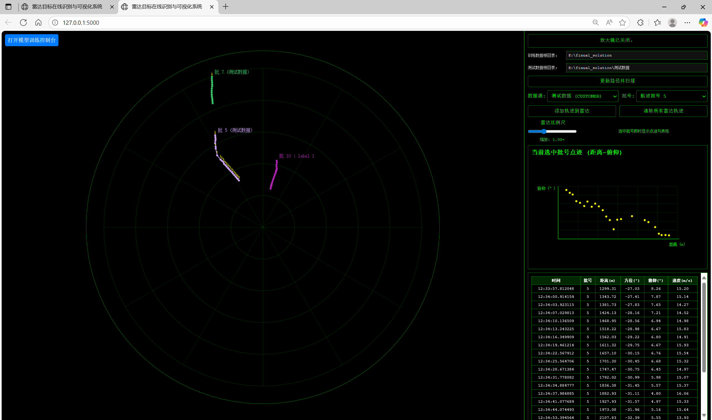

# 操作说明文档
本文档包含文件目录结构，文件功能的概括，以及如何使用本项目

# 项目目录如下
```
tree
.
|── 点迹                        <--------存放点迹数据
|── 航迹                        <--------存放航迹数据
|── 原始回波                     <--------存放原始回波
|── 测试数据                     <--------这是为比赛测试专门预留的通道！！
├── gradio_src                  <--------这是跟gradio可视化相关的代码文件夹
│   ├── gradio_interface.py
│   ├── run_prediction_process.py
│   └── run_training_process.py
└── templates                   
|    ├── index.html           
├── src                         <--------核心代码所在的文件夹
│   ├── model_save
│   │   ├── best.pth
│   │   ├── label_map.json
│   │   └── tabular_scaler.npz
│   ├── online_prediction_results
│   │   ├── online_confusion_matrix.png
│   │   └── online_prediction_details.csv
│   ├── apply.py
│   ├── model.py
│   ├── preprocess.py
│   ├── scoring.py
│   ├── train.py
│   ├── utils.py
│   └── valid.py
│   └── get_DR_fortest.m
│   └── get_DR_fortrain.m
├── myenv.yml
├── app.py
├── split_dataset.py

```

## 2.对于文件的解释
### src(核心代码)
- preprocess.py  ：定义了所有的预处理操作，包括DR map的加载，标准化处理，处理时间变量，构建多模态数据组合等
- model.py : 定义了模型的结构
- train.py ：训练脚本，直接运行即可开始训练（启动前请确定已正确划分训练集和验证集）
- valid.py ：验证脚本，用于评估模型能力，会使用测试集数据进行验证（启动前请确定已正确划分测试集）
- scoring.py : 对valid.py的输出结果进行打分。脚本会按照赛题组的评估标准计算准确率，有效周期，并输出出错批号，方便发现问题
- apply.py ：使用训练练好的模型应用到未知数据。
- get_DR_fortrain.m ：用于从原始回波中得到DR map数据，并保存为npy格式。会保留label
- get_DR_fortest.m  ：用于从原始回波中得到DR map数据，并保存为npy格式。不会保留label

### 2.gradio_src（gradio可视化）
>为了方便操作，本项目提供一个可视化操作窗口，用gradio实现
- gradio_interface.py ：总接口，运行它可以启动可视化操作窗口（包括训练和应用于待测试数据）
- run_prediction_process.py ：定义了应用于待测试数据相关的操作
- run_training_process.py ：定义了与模型训练相关的操作

### 3.其他
- app.py :用flask搭建的后端，对应templates下的index.html，有一个可以展示数据的界面，包括雷达图，点迹分布等
- split_dataset.py ：用于自动划分数据集，共划分为3类，分别是train,val,test,默认比例为7：1.5：1.5，可自定义                  

## 3.快速开始
### (1).准备数据集
你的数据集必须包含下面三个子文件夹
```
|── 点迹                   
|── 航迹                       
|── 原始回波  
```
然后打开matlab运行**get_DR_fortrain.m**，它会从.dat中提取出DR map并用npy格式保存

随后
```
python split_dataset.py
```

它会在本地生成一个DRmap文件夹，并按比例划分数据
至此，数据集准备完毕

### (2).依赖安装
本项目涉及到matlab和python两种语言。

1.安装matlab

从这里[下载](https://www.mathworks.com/products/matlab.html)并安装


2.安装python依赖
本项目提供两种方式
你可以
```
pip install -r requirement.txt
```
或者下载conda-pack打包好的环境,下载并解压到你的电脑，然后运行
```
conda-unpack
activate
```

### (3).训练
```
python train.py
```
模型保存在同级目录的model_save目录下
### (4).模型评估
```
python valid.py
python scoring.py
```
预测结果会保存在同级目录的online_prediction_results目录下
### (5).应用到自定义数据
你需要像(1).准备数据集那样准备数据集。

同样的你的数据集必须包含下面三个子文件夹
```
|── 点迹                   
|── 航迹                       
|── 原始回波  
```
随后打开matlab运行**get_DR_fortest.m**，它会从.dat中提取出无label格式DR map并用npy格式保存

接着运行
```
python apply.py
```
预测结果会直接写回你的数据集中的航迹文件，并添加在最后一列。同时同级目录test_results_output下也会生成备份方便后续工作

## 4.可视化操作界面
你也可以直接在gradio界面上进行操作
```
python gradio_interface.py
```
随后浏览器打开http://127.0.0.1:7860 即可访问

(训练界面，各种参数均可调节，点击开始训练按钮即可正常训练)


(填入正确路径即可开始预测)

>受限与gradio不支持系统原生的文件目录管理器，这里只能手动填入路径。

## 5.数据展示
```
python app.py
```
随后浏览器打开 http://127.0.0.1:5000 即可访问


该界面支持所有批号选择（包括训练数据和待测试数据），会展示雷达航迹图，对应点迹分布，批号的具体数据，预测结果（待测试数据）。支持图片比例尺调节，路径选择，放大查看（在雷达图上长按左键）


注意：

1.本项目全程在linux系统上开发， **强烈建议你在linux系统中使用我们的项目！** 由于windows不支持fork的子进程创建，NTFS文件系统低效的查询方式，不支持utf-8，路径复杂等特点，可能会出现各种影响体验的情况（比如训练速度很慢，路径极易出错等）。
尽管上述问题都已经在代码中解决。

2.关于路径：
- 对于训练过程的数据（train，val,test），我们都是通过DR map划分。通过DR map里不同类别匹配到的批号在航迹（Tracks）中读取每个点的编号，再反过来从DR map文件夹里定位到对应的npy文件。
虽然这样做体现在代码里极其复杂，但是这尽可能的保留了原本的数据格式。

- 对于待测试数据，你只需要解压，并选择数据根目录就可以正常工作。

3.关于是否作弊的解释：
因为项目中使用了LSTM，涉及到跨时间处理数据，但是本项目中的LSTM是单向的，不会出现用后面的数据预测前面的点的情况。**并且为了避免误解，apply.py中牺牲了推理速度，使用逐点推理。虽然数据集一次性都给出来了，但是我们依旧模拟每次只开放一个点的情况。每次只给模型开放当前点和之前周期的数据，后面的数据模型根本看不到，因此100%不会出现作弊嫌疑**

4.参数的调节

对于batch_size,learning_rate,pic_size,num_epochs等常用参数，都是可以自己调整的。你可以在train.py,valid.py,apply.py的主函数部分，有一个名为CONFIG的字典，里面保存了所有要用到的参数，你可以直接修改这个字典进行调整。
它类似下面的结构
```python
if __name__ == '__main__':

    CONFIG = {
        'data_root_dir': os.path.join(BASE_DIR, '../'),
        'img_size': (224, 224),
        'batch_size': 16, 
        'learning_rate': 1e-4,
        'num_epochs': 50,
        'patience': 10,
        'model_save_dir': os.path.join(BASE_DIR, 'model_save'),
        'log_dir': os.path.join(BASE_DIR, 'logs'),
        'grad_clip': 1.0,
        'warmup_epochs': 2,
        'max_seq_len': 30,  # 最大序列长度，根据数据分布设置
        'mod':'train'
    }

    main(CONFIG=CONFIG) 
```

当然，你也可以在gradio界面上调整，两者是完全等效的。

5.关于开发过程：
在最终方案确定前，我们团队还尝试过多种不同的方案，本方案为综合考虑最好的一版。你可以访问https://github.com/Rachel1477/tiao_zhan_bei 来查看其他结果（仓库会在8.15提交赛题之后开放为public）

